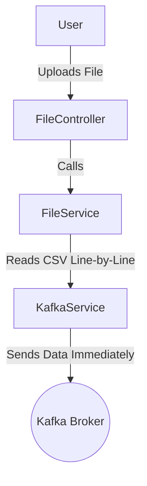

# 1. Overview

This project processes large CSV files containing user segmentation data and sends it to a Kafka topic for further
downstream processing. The system uses Spring Boot as the backend, with the following key components:

File Processing: Handles CSV file uploads and reads the data line-by-line.

Kafka Integration: Sends each record to a Kafka topic.

Error Handling: Global exception handling for various errors such as file size limits and Kafka failures.

# 2. Workflow



# 3. API Design

- Endpoint: POST /api/v1/files/process
- Description: Accepts a CSV file for processing and pushes data to Kafka.
- Request Parameters:
    - `file`: Multipart file containing the CSV data.
- Response:
    - `200 OK`: File is being processed.
    - `400 Bad Request`: If the file is empty or invalid.
    - `413 Payload Too Large`: If the file exceeds size limits.
    - `500 Internal Server Error`: If an error occurs during processing.
- Example Request:

```shell
curl -X POST "http://localhost:8080/api/v1/files/process" \
     -F "file=@/path/to/file.csv"
```

- Example Response:

```json
{
  "message": "File processing started successfully."
}
```

# 4. Exception Handling

All exceptions are handled by the GlobalExceptionHandler class, defined with `@ControllerAdvice`. This class uses
`@ExceptionHandler` annotations to handle specific exceptions:

- Exception.class: Catches all uncaught exceptions and returns a `500 Internal Server Error`.
- MaxUploadSizeExceededException.class: Handles file size limit exceed, returning a `413 Payload Too Large`.
- MultipartException.class: Manages multipart file upload errors, returning a `400 Bad Request`.
- IOException.class: Catches I/O errors during file processing, returning a `500 Internal Server Error`.
- KafkaException.class: Handles Kafka-related errors, returning a `500 Internal Server Error`.
  Each type of exception is specifically defined to provide a clear and appropriate response based on the error
  encountered.

# 5. Design Decisions

## 5.1 File Processing

Uses BufferedReader to process the CSV file line-by-line, avoiding memory issues.
Skips the header line if present.
Validates that each line contains exactly two fields.

## 5.2 Kafka Integration

Uses Kafka for high-throughput, fault-tolerant stream processing.
KafkaService handles message production.
Configures Kafka producer with StringSerializer for message formatting.